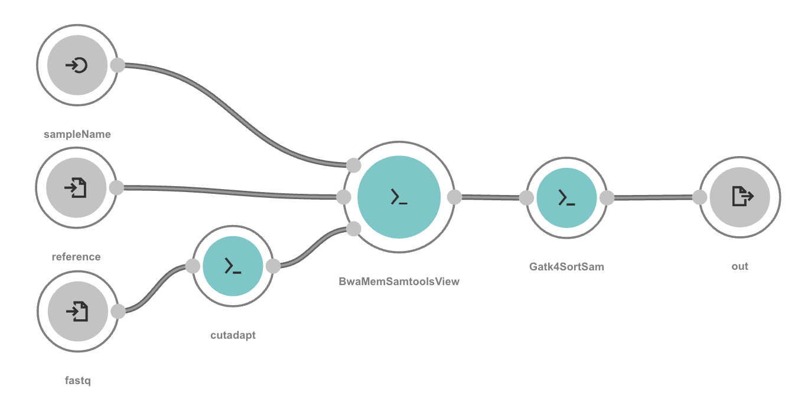

# Introduction to Janis at Peter Mac

Janis is workflow framework that uses Python to construct a declarative workflow. It has a simple workflow API within Python that you use to build your workflow. Janis converts your pipeline to the Common Workflow Language (CWL) and Workflow Description Language (WDL) for execution, and it’s also great for publishing and archiving.

Janis can run pipelines at Peter Mac, as it knows how to interact with Slurm.

This tutorial has a bioinformatics focus, although Janis is generic as a workflow assistant and can be used outside of the computational genomics.

Important Links:

- Janis GitHub: https://github.com/PMCC-BioinformaticsCore/janis
- Janis Documentation: https://janis.readthedocs.io/en/latest
- This workshop: https://github.com/PMCC-BioinformaticsCore/janis-workshops/tree/master/petermac/workshop1

## Learning outcomes

In this workshop, we'll learn:

- What is Janis, 
    - How Janis is different from seqliner
- How to load a Janis environment,
- How to run a simple workflow,
- How to align some samples.
- How to debug if something goes wrong (check logs)
- How to override amount of resources
- How to run same pipeline on cohort of samples,

## Foundations

- A workflow is a collection of tools are run in an organised manner.

- A workflow specification is a format that exactly describes the relationship between your tools. Popular workflow specification types include:

    - Common Workflow Language (CWL)
    - Workflow Description Language (WDL)
    - [_Unsupported_] Nextflow
    - [_Unsupported_] Snakemake

### What is Janis

Janis is a project that aims to address two questions:

- How do we build pipelines that can run everywhere?
- How can we make running pipelines easier?

In fact, Janis is actually split into two components that addresses these questions separately:

- `janis-core` - Helps users **build** portable pipelines using existing workflow **specifications**.
- `janis-assistant` - Helps users **run** pipelines using existing workflow **engines**.

### How is Janis different to BPipe?

- Janis uses an _abstracted execution environment_ which removes the shared file system you may be used to.

    - For a file or directory to be available to your tool, you need to EXPLICITLY include it. 
        - This includes associated files, if you want an indexed bam, you must use the BamBai type.

    - Outputs of a _tool_ must be EXPLICITLY collected to be used by future steps, else they will be removed.

    - Outputs of a workflow must be EXPLICITLY collected.
        - This is equivalent to a _SAVE_ stage in seqliner.

    - A step's requirements (its inputs) can be an input to a workflow, or the output of a previous step (hence creating a dependency).

        

- In Janis, all tasks are executed inside a isolated virtual environment called a [_Container_](https://www.docker.com/resources/what-container). Docker and Singularity are two common container types. (Docker containers can be executed by Singularity.)


## Getting started

Create a folder called `janis-workshop1` in a location where you have plenty of storage (we'd recommend your researcher folder).

```
mkdir janis-workshop1 && cd janis-workshop1
cp /data/janis/workshops/2020/workshop1/ .
```
